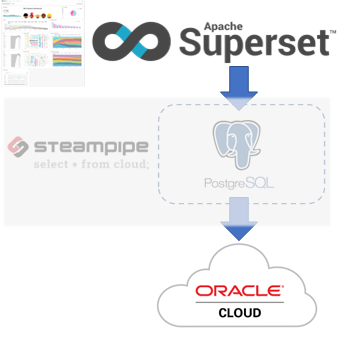
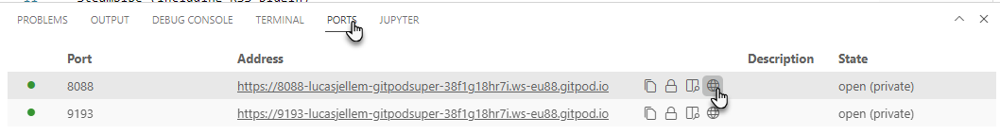
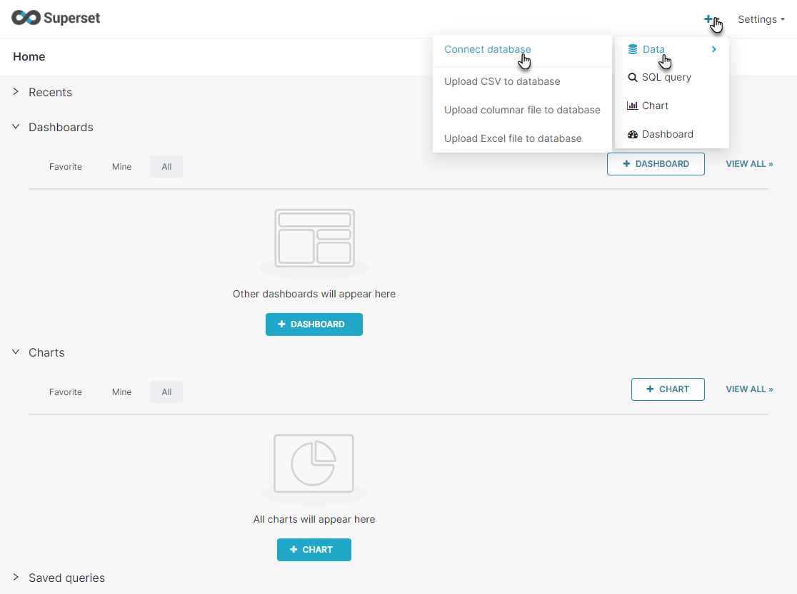
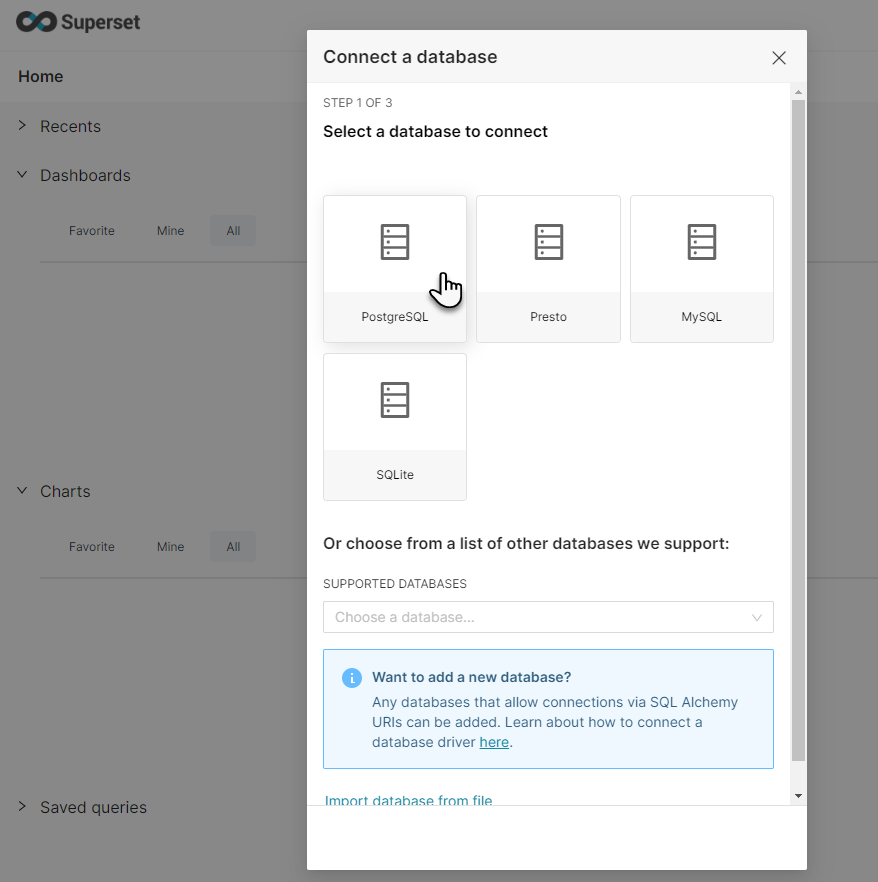
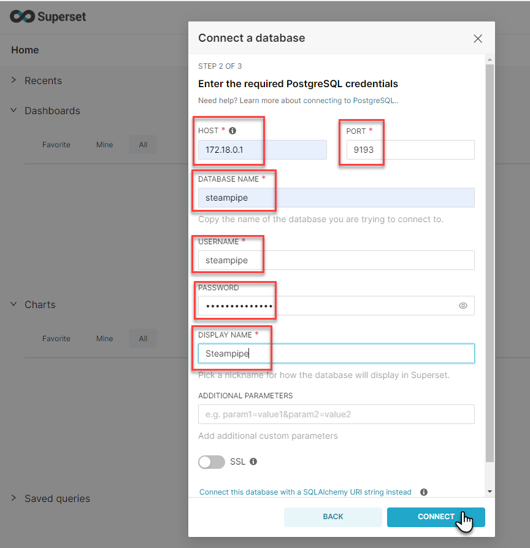
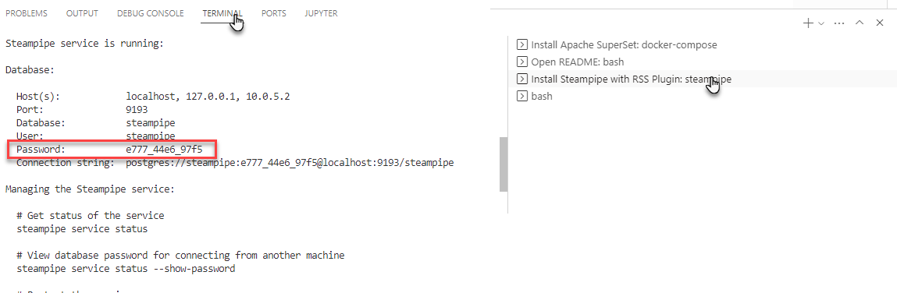
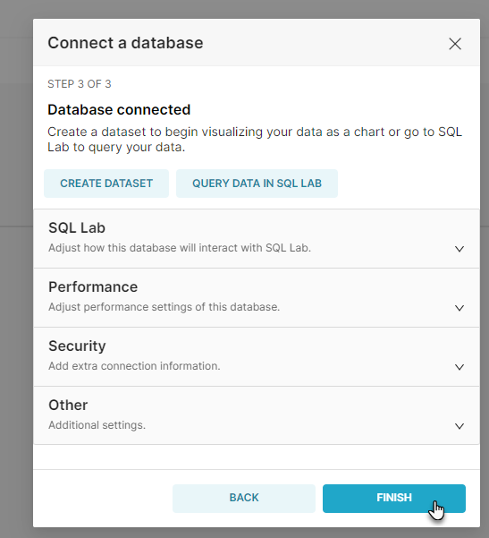

# gitpod-oci-steampipe-superset
Gitpod workspace for analyzing and visualizing Oracle Cloud Infrastructure resources using Apache Superset and Steampipe

  

[](https://gitpod.io/#https://github.com/lucasjellema/gitpod-oci-steampipe-superset)

Once the workspace is up and running, the following components will have been installed:

* Apache Superset (six Docker containers - coordinated by Docker Compose)
** PostgreSQL (metadata store for SuperSet)
** Redis
* Steampipe (including OCI plugin)
* PostgreSQL 

This picture shows the contents of the workspace:


## Configure OCI - Config file and Private Key

Before you can actually start working with Oracle Cloud Infrastructure, a little configuration is required. The configuration you probably have set up many times.

The files *config* and *oci_api_key.pem* in directory *.oci* need to contain proper connection details for your OCI account. Please edit both files, provide the correct information. Then these two files config and oci_api_key.pem need to be copied to directory *~/.oci*. Please execute these commands in the terminal to perform that copy action:

```
mkdir ~/.oci
cp .oci/config  ~/.oci
cp .oci/oci_api_key.pem  ~/.oci
# check both files are located where they should be
ls -l  ~/.oci
# fix (warning about) too broad file permissions
oci setup repair-file-permissions --file /home/gitpod/.oci/config
oci setup repair-file-permissions --file /home/gitpod/.oci/oci_api_key.pem
```

## Steampipe

Once the workspace has fully started and Steampipe is available, you can execute batch-mode (non-interactive) queries like this one:

```
steampipe query "select title, link, description from rss_channel where feed_link = 'https://technology.amis.nl/feed/'"
```

In order to look at data from Steampipe in Superset, we first need to add a database connection in Superset to Steampipe's PostgreSQL database.

# Superset - and Connection to Steampipe

Open port 8088 to enter the Superset web UI. 
  

Login with user admin and password admin.

Click on the plus icon. In the dropdown list select *Data*. In the child menu, click on *Connect database*.

  

The Database Connection configuration wizard appears. Click on the PostgreSQL tile.

  

 To configure the connection to the PostgreSQL database that Steampipe is running on, enter the following values:

* Host: 172.18.0.1
* Port: 9193
* database name: steampipe
* user: steampipe
* password: check in terminal window where steampipe was installed (or run: `steampipe service status --show-password `)
* Display Name: anything you like, for example *Steampipe* 

  

The password created for the *steampipe* user can be seen in the terminal window labeled *Install Steampipe with RSS Plugin*:
  

Click on the Connect button.

A window appears that indicates that the database has been connected. Press the Finish button.
  


