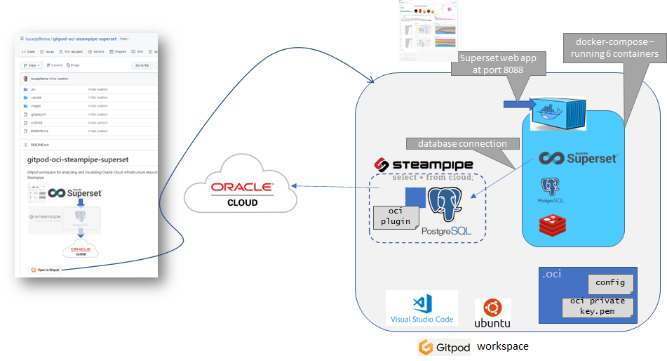
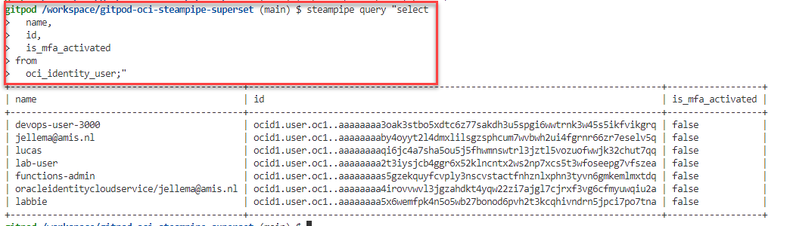
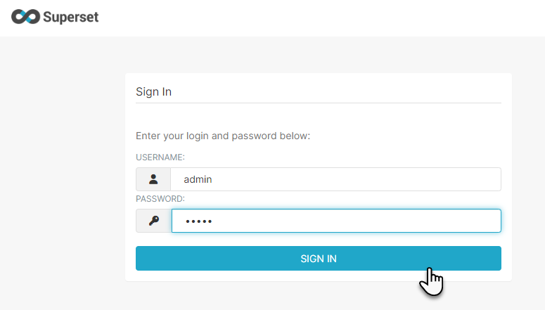
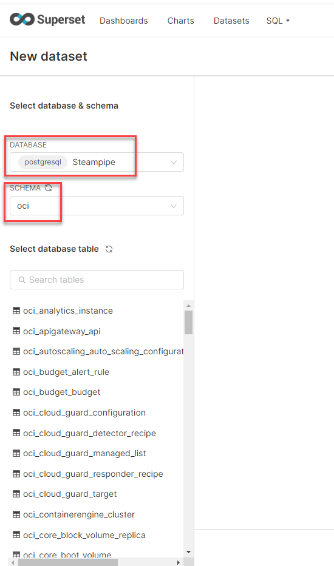
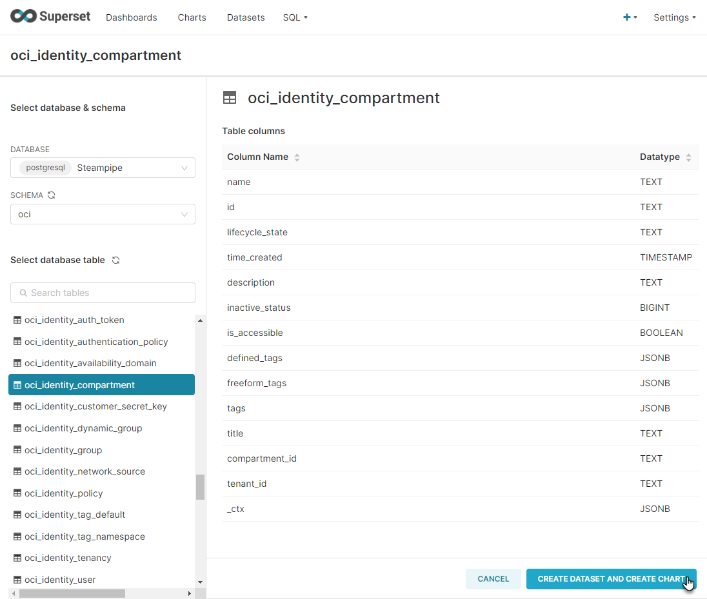
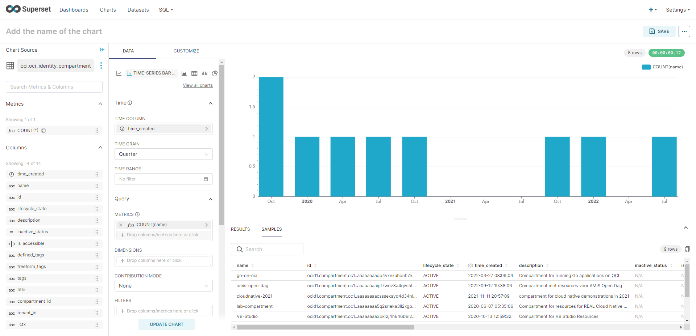
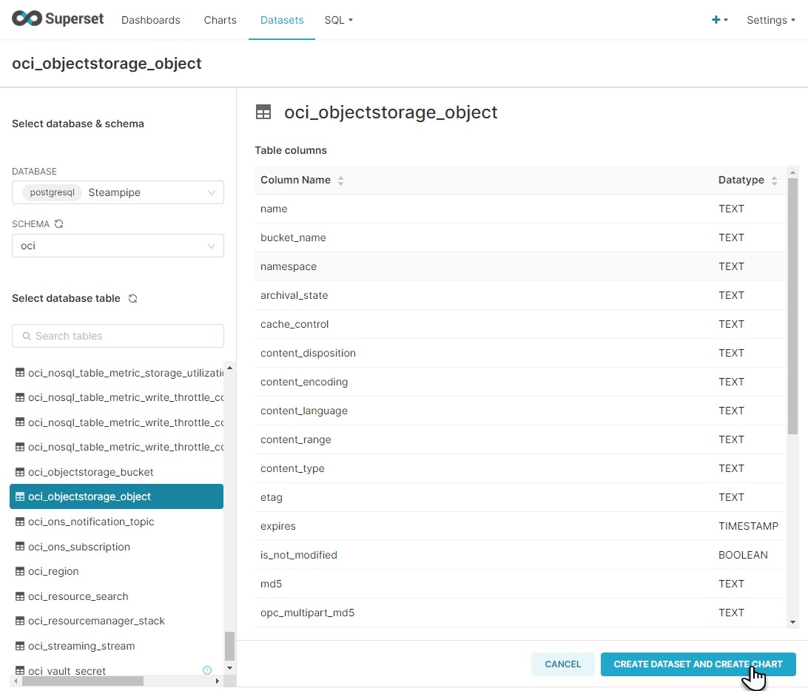
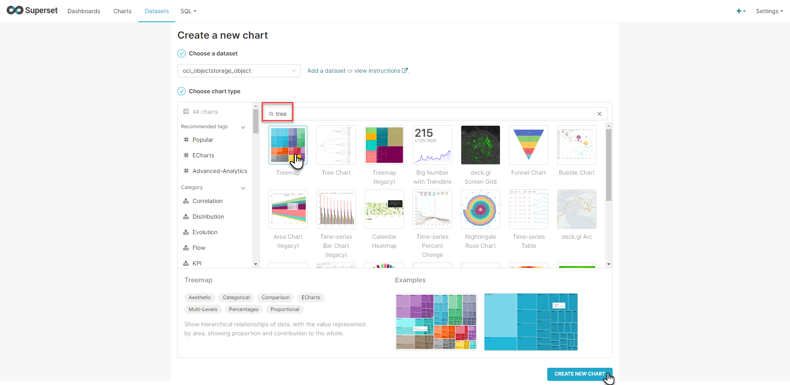
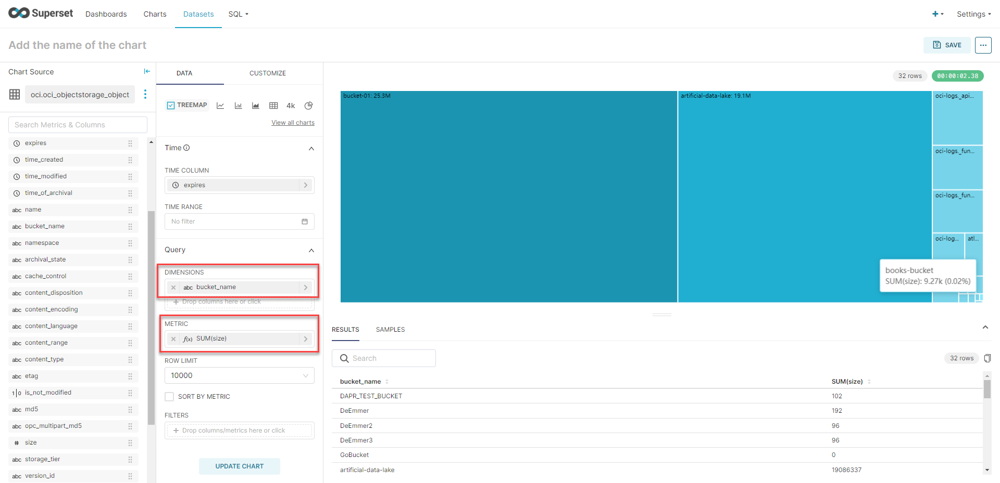
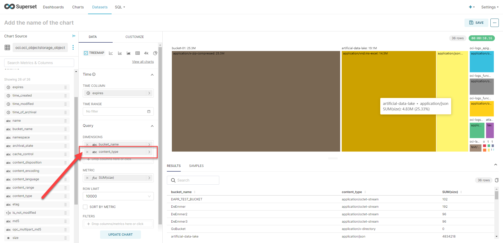

# gitpod-oci-steampipe-superset
Gitpod workspace for analyzing and visualizing Oracle Cloud Infrastructure resources using Apache Superset and Steampipe

  

[](https://gitpod.io/#https://github.com/lucasjellema/gitpod-oci-steampipe-superset)

Once the workspace is up and running, the following components will have been installed:

* Apache Superset (six Docker containers - coordinated by Docker Compose)
** PostgreSQL (metadata store for SuperSet)
** Redis
* Steampipe (including OCI plugin)
* PostgreSQL 

This picture shows the contents of the workspace:
  

Note: I have seen some instances where Superset did not startup successfully. I could remedy the situation easily by reissuing the statement to run docker-compose:

```
docker-compose -f docker-compose-non-dev.yml up      
```

## Configure OCI - Config file and Private Key

Before you can actually start working with Oracle Cloud Infrastructure, a little configuration is required. The configuration you probably have set up many times.

The files *config* and *oci_api_key.pem* in directory *.oci* need to contain proper connection details for your OCI account. Please edit both files, provide the correct information. Then these two files config and oci_api_key.pem need to be copied to directory *~/.oci*. Please execute these commands in the terminal to perform that copy action:

```
mkdir ~/.oci
cp .oci/config  ~/.oci
cp .oci/oci_api_key.pem  ~/.oci
# check both files are located where they should be
ls -l  ~/.oci
```

## Steampipe

Once the workspace has fully started and Steampipe is available, you can execute batch-mode (non-interactive) queries like this one:

```
steampipe query "select
  name,
  id,
  is_mfa_activated
from
  oci_identity_user;"
```

  

In order to look at data from Steampipe in Superset, we first need to add a database connection in Superset to Steampipe's PostgreSQL database.

# Superset - and Connection to Steampipe

Open port 8088 to enter the Superset web UI. 
  

Login with user admin and password admin.

  

Click on the plus icon. In the dropdown list select *Data*. In the child menu, click on *Connect database*.

  

The Database Connection configuration wizard appears. Click on the PostgreSQL tile.

  

 To configure the connection to the PostgreSQL database that Steampipe is running on, enter the following values:

* Host: 172.18.0.1
* Port: 9193
* database name: steampipe
* user: steampipe
* password: check in terminal window where steampipe was installed (or run: `steampipe service status --show-password `)
* Display Name: anything you like, for example *Steampipe* 

  

The password created for the *steampipe* user can be seen in the terminal window labeled *Install Steampipe with RSS Plugin*:
  

Click on the Connect button.

Note: if you get the message that "port is closed" (for port 9193) what may help is restart the Steampipe service:

```
steampipe service restart
```

A window appears that indicates that the database has been connected. Press the Finish button.
  

The New Dataset page appears. Select PostgreSQL | Steampipe as the database and oci as the schema.
  

A long list of tables is presented that all expose data for specific types of OCI Resources.

You can of course explore any of these tables. One you will have for sure is *oci_identity_compartments*:

  

With this data set in hand, it is fairly easy to create this chart that shows when I have created compartments in my tenancy:
  

### Treemap on Object Storage Buckets and Contents

Let's create a new Data Set for the OCI_OBJECTSTORAGE_OBJECT:

  

Click on the button *Create Data Set and Create Chart*.

Select chart type Tree Map and click on button *Create New Chart*.
  

Drag the column *bucket_name* to the Dimensions box and the column *size* to the Metrics box. Specify Sum as the aggregation operator.

Then click on Update Chart. This is the result in my case:

  

I next dragged column *content_type* the Dimensions box and refreshed the chart The treemap has now an additional level of nesting: each bucket is subdivided by *content_type*. Note that the order of the columns in the Dimensions definition is meaningful.

  

## Resources

[OCI Steampipe Plugin Documentation](https://hub.steampipe.io/plugins/turbot/oci)

